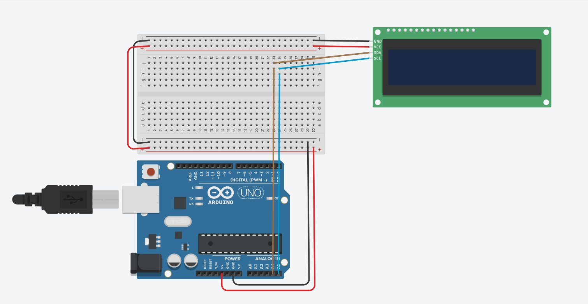
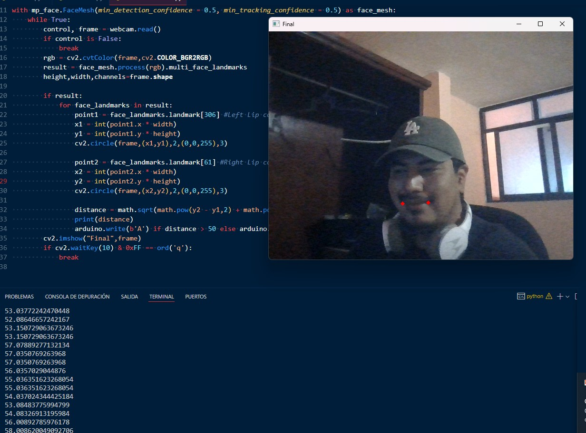
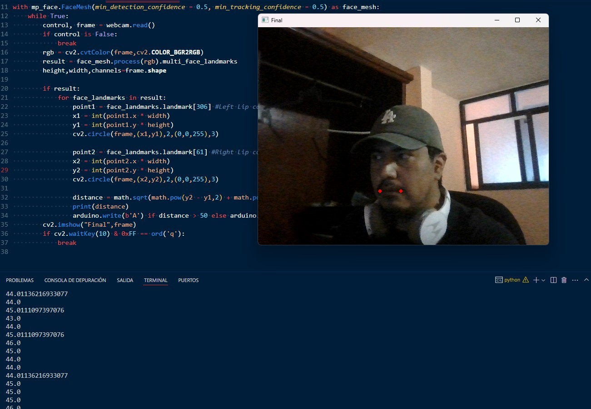
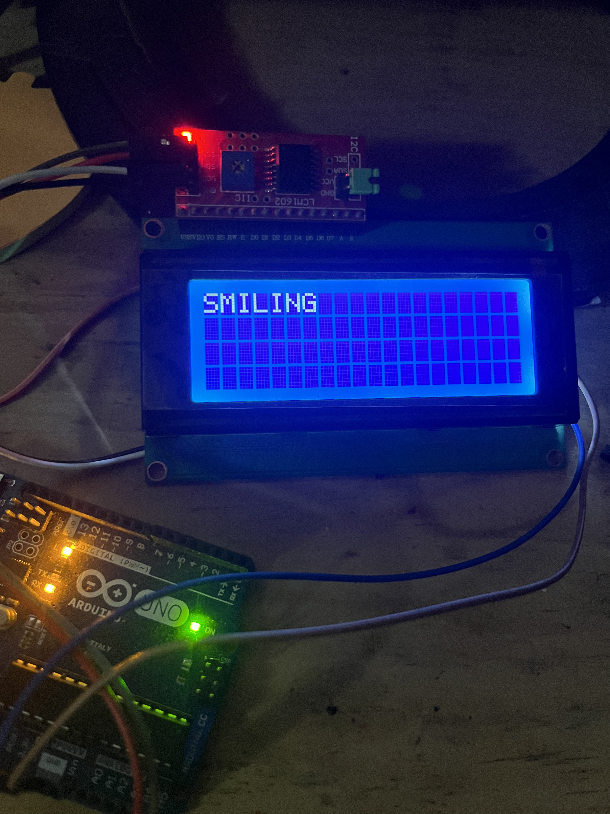
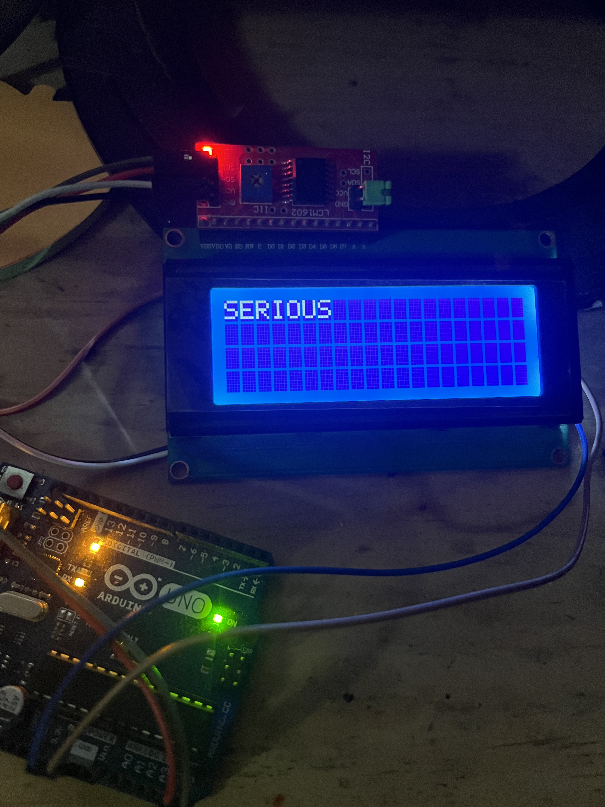
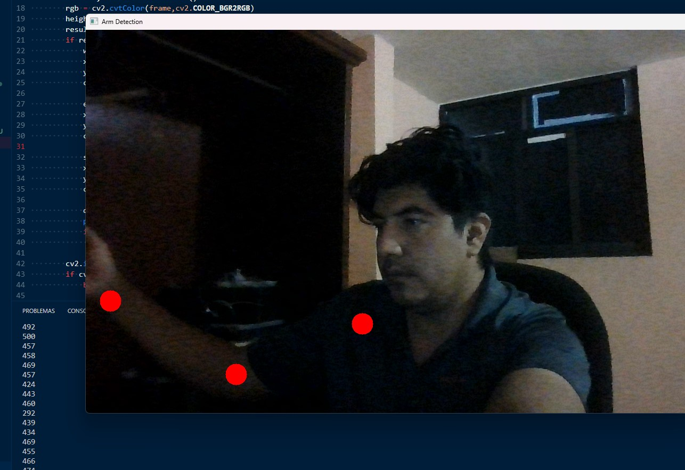

# Emotion Detector using OpenCV, MediaPipe, and Arduino

This project uses computer vision to detect whether a person is **smiling** or **serious** in real time, and displays the result on an **I2C LCD screen** connected to an Arduino.

---

## 📷 Project Overview

- The **Python** script uses the webcam and **MediaPipe** to analyze facial landmarks.
- It calculates the distance between the corners of the mouth to detect a smile.
- A character (`'A'` or `'B'`) is sent to the **Arduino** over a serial connection.
- The **Arduino** receives the character and updates the LCD display:
  - `'A'` → `"SMILING"`
  - `'B'` → `"SERIOUS"`

---

## 📁 Files

- `detector_emociones.py`: Python script for emotion detection.
- `detector_arduino.ino`: Arduino sketch for LCD display.
- `README.md`: This documentation file.

---

## ⚙️ Requirements

### Python

- Python 3.7 or higher
- Required libraries:
  - `opencv-python`
  - `mediapipe`
  - `pyserial`

Install the dependencies using `pip`:

bash
pip install opencv-python mediapipe pyserial
Arduino
Arduino UNO (or compatible)

I2C LCD display (16x2 or 20x4)

Library: LiquidCrystal_I2C
(Install via Arduino Library Manager)

🔌 Hardware Setup
Wiring the I2C LCD to Arduino:

LCD Pin	Arduino Pin
SDA	A4
SCL	A5

Connect the Arduino to your computer via USB.

🧠 Code Logic
Python (detector_emociones.py)
Captures video from the webcam.

Uses MediaPipe FaceMesh to detect facial landmarks.

Calculates the distance between landmarks 61 and 306 (mouth corners).

If distance > 50 → smiling ('A')

Else → serious ('B')

Sends the result to the Arduino via serial.

Arduino (detector_arduino.ino)
Initializes the I2C LCD display.

Waits for serial input.

Displays "SMILING" if it receives 'A'.

Displays "SERIOUS" otherwise.

▶️ How to Run
Upload detector_arduino.ino to your Arduino board.

Ensure the LCD screen shows the initial boot message.

Run the Python script:

bash
Copiar código
python detector_emociones.py
Watch the LCD change based on your facial expression.

Press q to exit.

📝 Notes
Make sure to set the correct serial port in the Python script:

python
Copiar código
arduino = serial.Serial('COM10', 9600)
On Linux/macOS, the port may look like /dev/ttyUSB0

🔧 Circuit

## 📷 Results

### 😄 Smiling

### 😐 Serious

### LCD showing "SMILING"

### LCD showing "SERIOUS"

# 🦾 Arm Position Tracker with Python (MediaPipe) and Arduino (Servo + LCD)

This project integrates **computer vision** with **Arduino hardware control**. Using a webcam and MediaPipe, the system tracks a person's **right arm position**, calculates the distance between the wrist and shoulder, and sends that value to an **Arduino**, which moves a **servo motor** and displays the corresponding angle on an **LCD** screen.

---

## 🎯 Project Overview

| Component      | Role                                                                 |
|----------------|----------------------------------------------------------------------|
| Python + OpenCV | Tracks arm landmarks using webcam and MediaPipe                    |
| Serial (USB)    | Sends calculated distance (200–500) from PC to Arduino             |
| Arduino         | Receives distance, maps it to 0–180°, moves servo accordingly       |
| LCD (I2C)       | Displays current servo angle based on received distance             |

---

## 🧠 Technologies Used

- **Python**: OpenCV, MediaPipe, pySerial
- **Arduino**: Servo library, LiquidCrystal_I2C library
- **Hardware**: Servo motor, I2C LCD display, Arduino board, USB cable

🤖 Arduino Code
🔧 What It Does

Listens on serial for distances (sent by Python).

Maps values from 200–500 to servo angles 0–180°.

Rotates a servo to that angle.

Displays the angle on an I2C LCD screen.

🔌 Wiring Overview
Component	Pin
Servo signal	D9
LCD SDA	A4 (Uno)
LCD SCL	A5 (Uno)
LCD VCC, GND	5V, GND

🔍 If LCD doesn't show text, check the I2C address with an I2C scanner (common: 0x27 or 0x3F).

🎥 Demo Idea (Optional)

Raise your arm in front of the webcam.

The servo moves depending on how high or low your wrist is.

Angle is shown on the LCD in real-time.

## 📷 Results

